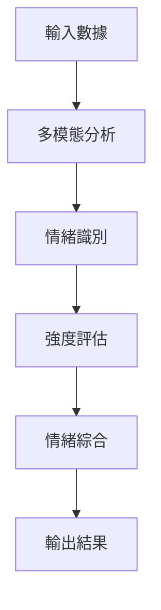

# 覺 (イシキ / Ishiki) - 情緒感知模組

## 模組簡介

覺(イシキ)是 TENSEI 系統的情緒理解核心，採用 SENS (Sensory Emotion Neural System) 技術，專門設計用於深度理解使用者的情緒狀態。基於大規模中文對話數據訓練，能夠精確捕捉對話中的情緒波動，實現真實的情感互動。

## 情緒光譜

覺模組能夠識別和分析五種核心情緒：

| 情緒 | 日文讀音 | 描述 |
|------|----------|------|
| 喜 | よろこび (Yorokobi) | 歡喜、愉悅的正面情緒 |
| 怒 | いかり (Ikari) | 憤怒、不滿的強烈情緒 |
| 哀 | かなしみ (Kanashimi) | 悲傷、失落的消極情緒 |
| 楽 | たのしみ (Tanoshimi) | 期待、享受的愉快情緒 |
| 怖 | おそれ (Osore) | 恐懼、擔憂的不安情緒 |

## 核心功能

### 1. 情緒識別系統
- **多模態情緒分析**
  - 文本情緒識別
  - 語音情緒分析
  - 表情情緒識別
  - 情緒強度評估

### 2. 實時處理能力
- **即時情緒追蹤**
  - 情緒狀態實時監測
  - 情緒變化趨勢分析
  - 情緒轉換點識別
  - 對話氛圍評估

### 3. 情緒資料整合
- **全方位情緒理解**
  - 統整多源情緒數據
  - 生成情緒綜合報告
  - 提供情緒應對建議
  - 情緒歷史記錄

## 技術特點

### 訓練數據
- 基於 50 萬筆標註中文對話
- 涵蓋多種場景和語境
- 豐富的情緒標記
- 持續更新和優化

### 處理流程


## API 規格

### 情緒分析請求
```json
{
    "text": "使用者輸入文本",
    "voice_data": "語音數據",
    "facial_expression": "表情數據"
}
```

### 情緒分析回應
```json
{
    "status": "success",
    "timestamp": "2024-01-07T10:30:00.000Z",
    "emotions": {
        "primary": {
            "type": "喜",
            "intensity": 0.85
        },
        "secondary": {
            "type": "楽",
            "intensity": 0.35
        },
        "spectrum": {
            "喜": 0.85,
            "怒": 0.05,
            "哀": 0.02,
            "楽": 0.35,
            "怖": 0.01
        }
    },
    "context": {
        "mood_trend": "positive",
        "confidence": 0.92
    }
}
```

## 與其他模組互動

### 輸入來源
- 響(ヒビキ)：語音情緒特徵
- 鏡(カガミ)：表情情緒特徵
- 文本輸入：對話內容

### 輸出目標
- 魂(タマシイ)：情緒狀態資訊
- 演(エン)：情緒表現指導

## 應用場景

1. **一般對話**
   - 即時情緒識別
   - 自然對話引導
   - 情緒共鳴回應

2. **特殊情境**
   - 情緒危機識別
   - 敏感話題處理
   - 情緒安撫回應

3. **長期互動**
   - 情緒變化追蹤
   - 使用者偏好學習
   - 情緒模式分析

## 未來展望

- [ ] 擴充情緒識別維度
- [ ] 提升多語言支援
- [ ] 加強情緒預測能力
- [ ] 優化實時處理效能
- [ ] 深化情緒理解準確度

## 注意事項

1. **資料安全**
   - 情緒數據加密保護
   - 隱私資訊安全處理
   - 敏感資訊過濾機制

2. **系統限制**
   - 需要足夠的上下文資訊
   - 特定方言可能影響準確度
   - 極端情緒需特別處理

3. **建議事項**
   - 定期更新情緒模型
   - 維護情緒辭典
   - 監控識別準確度

---

> 「感知情緒，共鳴心靈」
